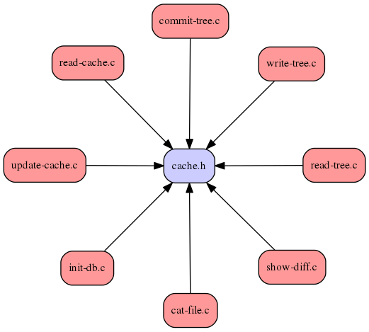

# CodeMap

__codemap.py__ will create a code dependency graph for __C/C++__ projects.

The python3 script generates a dot file, which is then passed into graphviz, a
supporting program that will autogenerate plots.

Currently, the script is written to be only supported in linux/macOSX. If there's
interest, I'd consider porting this version to also support other operating
systems (i.e. Windows).


# Installation

No installation necessary for this script.

However, the script _requires_ __graphviz__. Follow the install instructions
from the graphviz website for your platform:

* [archlinux](https://www.archlinux.org/packages/extra/x86_64/graphviz/files/) (AUR)
* [fedora](http://www.graphviz.org/Download_linux_fedora.php)
* [mac OSX](http://www.graphviz.org/Download_macos.php)
* [ubuntu/debian](http://www.graphviz.org/Download_linux_ubuntu.php)

Once installed, make sure that you have "neato" within your working path.

```
$ which neato
/usr/bin/neato
```

# Example

The image below is an example of the result when generating the codemap for the
original git source (hash e83c516).




# Usage

Run `codemap.py` inside of your source directory. By default, it will only use
the source/header files in the working directory (system header files such as
_stdio.h_ are ignored).

```
$ ./codemap.py
```

You may also search for source/header files recursively as so

```
$ ./codemap.py -r
```

If you want a black and white version of the generated dependency graph

```
$ ./codemap.py -n
```

Finally, what if you want a black and white version of the generated dependency
graph, AND you would like to ignore files that are not including any other header
in your source files?

```
$ ./codemap.py -m
```

You can specify the name of an output file. The extension will be passed into
graphviz to generate the appropriate file.

```
$ ./codemap.py -o jpeg-file.jpg
$ ./codemap.py -o postscript-file.ps
$ ./codemap.py -o png-file.png
```

See [here](http://www.graphviz.org/doc/info/output.html) for a complete list
of supported output formats
